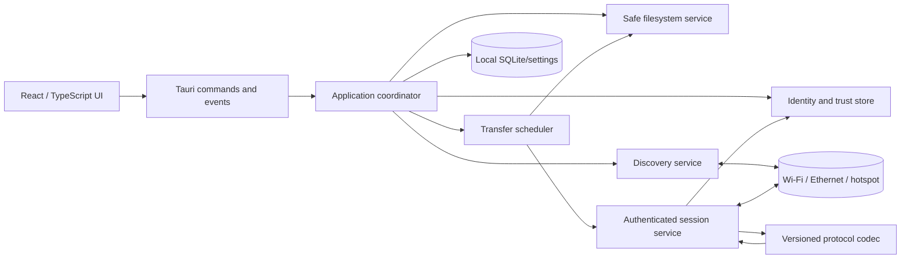
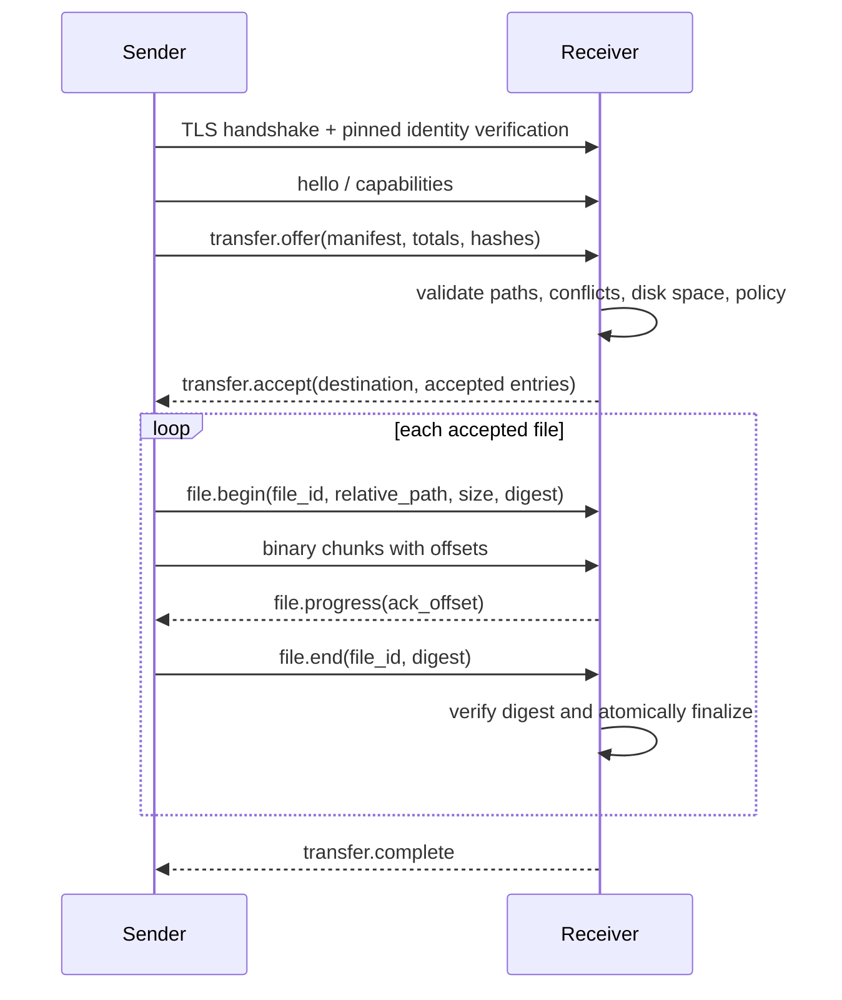

# Zapdrop: Full Implementation Research and Phased Engineering Plan

**Project:** Zapdrop  
**Repository:** `nexuss0781/Nexuss-Agents`  
**Document status:** Engineering research and implementation plan  
**Recommended first release:** Windows desktop MVP, with a portable architecture for macOS and Linux  
**Prepared by:** Manus AI

## Executive conclusion

Zapdrop should be implemented as a **native desktop application with a local Rust networking core and a React user interface**, not as a web page and not as a feature of the existing Node server. The repository is currently a Vite/React/TypeScript application with a Node/Express runtime, tRPC, Drizzle, and storage-oriented dependencies. That stack is appropriate for the existing web product but should not own a peer-to-peer LAN file-transfer service.

The recommended implementation is **Tauri 2 + React/TypeScript + Rust/Tokio**. Tauri places the web interface in a WebView and exposes native capabilities through controlled message passing, which matches Zapdrop’s division of responsibilities: React renders the explorer and transfer interface, while Rust controls filesystem access, network sockets, discovery, cryptography, scheduling, and persistence [1]. Tauri permissions and scopes should be narrow because enabling a filesystem permission does not by itself grant access to paths; commands also require explicit scopes [2].

For discovery, Zapdrop should advertise and browse a dedicated mDNS/DNS-SD service such as `_zapdrop._tcp.local`. DNS-SD uses service browsing and PTR, SRV, and TXT records to enumerate and resolve services [3]. The Rust `mdns-sd` crate is a practical implementation candidate because it supports service registration, browsing, resolution, monitoring, and shutdown, but its documented limitation is multicast-only operation [4]. Therefore, manual IP/port entry and a short invitation code must remain supported fallbacks.

For transport, the MVP should use **TLS 1.3 over TCP** with pinned device identities. TLS 1.3 is designed to provide authentication, confidentiality, and integrity over a reliable in-order transport [5]. Rustls provides TLS client and server functionality in Rust [6]. A future QUIC transport may improve multiplexing and path migration, but QUIC’s UDP-based protocol and larger implementation surface are unnecessary for the first reliable LAN release [7].

The core product rule is that **discovery is not trust**. A discovered device is only a candidate. The receiver must explicitly approve pairing and transfers, the application must bind a stable device identity to a public key, and received paths must be validated before any file is written. OWASP guidance reinforces the need for constrained storage, input validation, size limits, and careful handling of uploaded files [8].

## 1. Product scope and acceptance boundary

### 1.1 Product statement

Zapdrop allows users to install the application on multiple PCs, discover those PCs on the same Wi-Fi network, Ethernet network, or Wi-Fi hotspot, pair them with explicit approval, select local files and folders, and send the selection to one or more trusted PCs simultaneously. The file payload travels directly across the local network. A public internet connection, cloud account, central server, or cloud storage service is not required for discovery, pairing, or transfer.

The initial release must optimize for **correctness, safety, and predictable recovery** rather than a headline throughput number. A user should always know which devices are selected, where files will be saved, whether a transfer is awaiting approval, and why a transfer failed.

### 1.2 MVP scope

| Capability | MVP behavior | Deferred behavior |
|---|---|---|
| Desktop targets | Windows x64 first | macOS, Linux, ARM builds |
| Device discovery | mDNS/DNS-SD on the local link | Enterprise discovery services |
| Fallback connection | Manual local IP and port; invitation code | Cloud relay or NAT traversal |
| Device identity | Random persistent device ID plus key pair | Organization-managed identities |
| Pairing | Two-sided user approval with verification code | QR onboarding, device groups |
| Security | TLS 1.3 plus pinned peer public key | Hardware-backed identity, managed certificates |
| File selection | Files, folders, mixed multi-select | Clipboard, drag-and-drop shell extensions |
| Transfer targets | One or many trusted PCs | Phones, tablets, browser clients |
| Parallelism | Independent bounded session per recipient | Shared block fan-out optimization |
| Receiver behavior | Explicit approval by default | Fully automatic trusted-sender rules |
| Destination | User-selected safe root, default Zapdrop folder | Remote destination browsing |
| Conflicts | Keep both, replace, skip, ask | Advanced sync/merge semantics |
| Recovery | Retry from the beginning; offsets preserved for future resume | Full resumable interrupted jobs |
| History | Local job metadata and outcome | Searchable cross-device history |
| Internet | No dependency for the core workflow | Optional update/telemetry services |

### 1.3 Non-goals

The first release should not include accounts, cloud storage, internet relays, unrestricted remote filesystem browsing, remote command execution, silent acceptance from unknown devices, automatic execution or preview processing of received files, or automatic overwrite. These features would expand the threat model and delay the core reliability proof.

### 1.4 Definition of done for the MVP

The MVP is complete when two clean Windows installations can discover each other on the same private Wi-Fi network or hotspot, complete a verified pairing exchange, select a mixed set of files and folders, transfer them over an encrypted connection, show progress on both sides, safely handle a conflict, verify content integrity, and leave no incomplete file presented as completed after cancellation or failure.

The multi-recipient requirement is complete when a single selection can be sent to at least two trusted PCs using independent sessions, with each recipient showing separate progress and outcome. A failed or disconnected recipient must not corrupt or cancel successful transfers to the other recipients.

## 2. Repository strategy and project boundaries

### 2.1 Current repository constraint

The selected repository is an existing web-oriented application. Its package metadata defines Vite build scripts, a Node/Express server, TypeScript checking, Vitest tests, Drizzle migrations, and a substantial React dependency set. The repository should remain buildable as its existing application while Zapdrop is introduced as an independent desktop product.

The recommended boundary is:

```text
Nexuss-Agents/
├── apps/
│   └── zapdrop-desktop/
│       ├── src/                       # React/TypeScript desktop UI
│       ├── src-tauri/
│       │   ├── src/
│       │   │   ├── commands/           # Tauri commands exposed to the UI
│       │   │   ├── discovery/          # mDNS and fallback discovery
│       │   │   ├── identity/           # keys, certificates, trust store
│       │   │   ├── protocol/           # frames, schemas, validation
│       │   │   ├── transfer/           # jobs, streams, scheduling
│       │   │   ├── filesystem/          # safe local paths and atomic writes
│       │   │   ├── persistence/         # SQLite/settings/history
│       │   │   └── lib.rs
│       │   ├── capabilities/            # Tauri capability files
│       │   ├── migrations/
│       │   └── Cargo.toml
│       ├── package.json
│       └── README.md
├── packages/
│   └── zapdrop-protocol/               # versioned schemas and shared constants
├── docs/
│   ├── ZAPDROP_IMPLEMENTATION_PLAN.md
│   └── ZAPDROP_FULL_RESEARCH_PHASED_PLAN.md
└── existing web application...
```

If the repository does not yet use a workspace layout, the first implementation phase can create `apps/zapdrop-desktop` without restructuring the entire existing application. The desktop app must not require the current Node server to be running. It must launch and perform the complete local transfer workflow while offline.

### 2.2 Architectural rule

The WebView is an untrusted presentation boundary from the perspective of native authority. React can request an operation, but Rust must validate the operation, enforce permissions, normalize paths, and own the result. The UI should not receive an unrestricted shell, arbitrary filesystem API, or raw socket API.

## 3. System architecture

### 3.1 Logical components



### 3.2 Responsibilities by layer

| Layer | Owns | Must not own |
|---|---|---|
| React UI | Rendering, selection state, dialogs, progress presentation | Cryptographic decisions, raw paths, socket lifecycle |
| Tauri IPC | Narrow command/event bridge | Business authorization by itself |
| Application coordinator | Startup/shutdown, service orchestration, policy | Byte-level streaming implementation |
| Discovery | Advertisement, browse events, peer expiration, fallback probes | Trust decisions or file access |
| Identity/trust | Device keys, certificate/public-key pinning, pairing state | UI rendering |
| Protocol codec | Framing, schema validation, version negotiation | Filesystem path resolution |
| Transfer scheduler | Job state, bounded concurrency, retry/cancel, progress | Direct UI manipulation |
| Filesystem service | Normalization, manifest, safe temp files, atomic finalization | Network access |
| Persistence | Settings, trusted peers, job history | Large file payloads |

### 3.3 Process lifecycle

On startup, the native coordinator loads settings and the persistent device identity, selects allowed local interfaces, starts the transfer listener, starts mDNS registration, starts discovery browsing, and emits a readiness event. Startup failure in one optional subsystem must be visible without preventing the local UI from opening. For example, mDNS failure should leave manual connection available.

On shutdown, the coordinator stops new incoming requests, marks active jobs as interrupted, flushes history, unregisters the mDNS service, closes listeners, cancels discovery channels, and releases temporary resources. The application must distinguish a graceful cancellation from a crash or forced termination in history.

### 3.4 Technology decision matrix

| Decision | Recommended choice | Alternative | Reason for recommendation |
|---|---|---|---|
| Desktop shell | Tauri 2 | Electron, .NET MAUI, Flutter | Reuses React, keeps native networking/filesystem in Rust, avoids shipping a separate browser runtime [1] |
| Native language | Rust | Go, C#, Node native addon | Strong filesystem and concurrency model; integrates with Tauri |
| Async runtime | Tokio | async-std, blocking threads | Mature async I/O and networking ecosystem |
| Discovery | mDNS/DNS-SD through `mdns-sd` | Custom UDP broadcast, platform APIs | Standardized service model and cross-platform Rust API [3] [4] |
| Transport | TLS 1.3 over TCP | QUIC, plain HTTP | Easier MVP debugging and reliable stream semantics; encrypted by default [5] [6] |
| Local storage | SQLite plus OS-protected key storage | JSON files only | Transactions and queryable history; safer evolution |
| UI state | React state plus a typed event store | Global ad hoc state | Clear job and peer lifecycle handling |
| Protocol encoding | JSON control frames plus binary payload frames | Protobuf, MessagePack | Inspectable during early development; can migrate behind a versioned codec |
| Packaging | Tauri Windows installer | Portable ZIP only | Better user install/uninstall and firewall association |

## 4. Network discovery design

### 4.1 Primary mDNS/DNS-SD flow

Each running Zapdrop instance creates a local service daemon, registers its TCP listener, and browses for the Zapdrop service type. DNS-SD supports service instance enumeration and resolution using standard record types including PTR, SRV, and TXT [3]. The advertisement must contain only data needed to identify and connect to the service.

```text
Service type: _zapdrop._tcp.local.
Instance: <display-name>-<short-id>._zapdrop._tcp.local.
SRV: ephemeral TCP port and hostname
TXT:
  v=1
  id=<random-stable-device-id>
  name=<display-name>
  platform=windows|macos|linux
  caps=folder,multi-recipient,hashes
```

The service instance name is user-facing, so it must be escaped and length-limited. The stable ID must be randomly generated and persisted; it must not be derived directly from the MAC address, hardware serial, or operating-system account name. Discovery metadata is advisory and must be revalidated during the authenticated session.

### 4.2 Peer state model

| State | Meaning | User action |
|---|---|---|
| `discovered` | Service resolved but not trusted | Pair or ignore |
| `pairing_requested` | Local pairing request awaiting response | Cancel or wait |
| `pairing_incoming` | Remote device requested pairing | Approve or reject |
| `trusted` | Public key is pinned locally | Share or revoke |
| `online` | Trusted peer has a recent reachable endpoint | Share |
| `offline` | Trusted identity remains but service is not reachable | Rescan or use fallback |
| `key_changed` | Same device ID presented a different key | Block and require re-pair |
| `blocked` | User has explicitly blocked the peer | Unblock in settings |

### 4.3 Fallback discovery

Because `mdns-sd` documents multicast-only operation [4], the application needs a fallback. The first fallback is manual IP and port entry. The user should be able to enter `192.168.x.x:port` or an IPv6 local address when known. The application should perform a short authenticated probe rather than treating a successful TCP connection as trust.

A second fallback can be a short invitation code that encodes the sender’s local endpoint, a one-time nonce, and a public-key fingerprint. The code may be displayed as text or QR in a later phase. It must expire quickly and must not bypass the normal pairing confirmation.

Broad subnet scanning should not be the default because it is noisy, slow on larger networks, and can trigger firewall or intrusion-detection alerts. If it is ever added, it must be opt-in, rate-limited, limited to private address ranges, and clearly disclosed.

### 4.4 Network conditions

| Condition | Detection | Product behavior |
|---|---|---|
| Private Wi-Fi | mDNS and TCP probe succeed | Show Ready and available peers |
| Hotspot with client isolation disabled | mDNS/TCP succeed | Operate normally |
| Guest Wi-Fi or AP isolation | No peer TCP reachability | Explain that the network blocks peer-to-peer traffic |
| mDNS blocked | Listener works but no browse results | Show manual IP/invitation fallback |
| Multiple interfaces | Multiple local addresses | Prefer private active interface; show diagnostics |
| VPN present | Unusual routes or extra interfaces | Avoid advertising on VPN unless user allows it |
| Windows firewall blocks listener | TCP probe fails locally/remotely | Provide scoped private-network firewall guidance |
| Peer address changes | mDNS SRV/address event changes | Re-resolve; keep trust bound to identity, not IP |

Windows firewall rules should be scoped to the application and private networks. Microsoft documents that inbound allow and block rules interact by precedence and that legitimate applications may require an inbound exception [9]. Zapdrop must never instruct the user to disable Windows Firewall globally.

## 5. Identity, pairing, and session security

### 5.1 Identity records

At first launch, generate and persist:

| Field | Purpose |
|---|---|
| `device_id` | Random stable identifier used for discovery and peer references |
| `display_name` | User-visible device name |
| `identity_keypair` | Public/private key for device authentication |
| `certificate` | Optional self-signed certificate containing the public key |
| `created_at` | Identity lifecycle audit field |
| `identity_version` | Allows future key migration |

The private key should be stored using OS-protected storage where the chosen Tauri plugin/platform supports it. If the identity is reset, the UI must warn that all trusted-peer bindings will be invalidated.

### 5.2 Pairing state machine

```text
DISCOVERED
    |
    | user selects Pair
    v
PAIR_REQUEST_SENT  <------>  PAIR_REQUEST_RECEIVED
    |                              |
    | both users approve            | both users approve
    v                              v
VERIFICATION_CODE_SHOWN -----> CODE_MATCHED
                                   |
                                   v
                            PEER_KEY_PINNED
                                   |
                                   v
                                TRUSTED
```

The pairing exchange should include both device IDs, both public keys or certificate fingerprints, a fresh nonce, a protocol version, and an expiration time. The short verification code should be derived from both identities and the session nonce so that an attacker cannot simply copy a stale code from a previous pairing. Both users must approve before the peer is stored as trusted.

### 5.3 Trust persistence

Store trusted peers by `device_id` and pinned public key. The current IP address, hostname, display name, and last-seen timestamp are replaceable metadata. A changed key is a hard security event. The UI should show **Identity changed — re-pair required**, not silently replace the key.

### 5.4 TLS session

The transport listener negotiates TLS, verifies the connecting peer’s presented identity against the local trust record, and then performs an application handshake. TLS 1.3 protects the channel against eavesdropping, tampering, and message forgery when correctly configured [5]. Rustls provides the client/server connection primitives and certificate verification behavior [6].

Zapdrop should not use plaintext as a fallback after a TLS failure. If a future compatibility mode supports a non-TLS local connection, it must be a separately visible and explicitly enabled mode, not an automatic downgrade.

### 5.5 Threat model

| Threat | Control | Test |
|---|---|---|
| Unknown device advertises Zapdrop | Discovery never grants trust | Unknown peer cannot list or write files |
| Man-in-the-middle during pairing | Two-sided approval and visual verification code | Modified key/code is rejected |
| Stolen local private key | OS-protected storage; identity reset; key rotation design | Simulate missing/corrupt key |
| Replay of old pairing request | Fresh nonce and expiration | Replayed request fails |
| Changed device key | Pinned identity and hard re-pair | Key mismatch blocks connection |
| Malicious path | Relative path schema and root containment check | Traversal and symlink tests |
| Resource exhaustion | Frame limits, file count/size limits, bounded concurrency | Oversized manifest and many recipients |
| Partial/corrupt file | Temp file plus digest before rename | Truncated and corrupted payload tests |
| Unauthorized overwrite | Explicit conflict policy | Existing-file matrix |
| Firewall exposure | Private-interface binding and scoped rule | Public-interface scan and firewall test |
| Sensitive metadata leak | Minimal discovery TXT fields and redacted logs | Inspect packets/logs |

## 6. Versioned application protocol

### 6.1 Protocol requirements

The protocol must be versioned from its first implementation. Every control message should be length-delimited and validated against a maximum size before parsing. Each message should include a type, protocol major version, request ID, timestamp or nonce where applicable, and a monotonically increasing sequence number within the session.

The control channel and binary payload channel may share one TLS connection for the MVP. The codec must still distinguish control frames from binary data and must never interpret arbitrary file bytes as JSON. A future implementation may use separate multiplexed streams without changing the logical job model.

### 6.2 Message envelope

```json
{
  "v": 1,
  "type": "transfer.offer",
  "request_id": "req_01J...",
  "job_id": "job_01J...",
  "seq": 12,
  "body": {}
}
```

Recommended maximums should be configurable constants, not scattered literals:

| Limit | Initial value to validate experimentally |
|---|---:|
| Control frame | 1 MiB |
| Manifest entries | 100,000 |
| Relative path length | Platform-aware; reject unsafe extremes |
| Single file size | 16 TiB logical limit; validate available disk and platform |
| Total job size | User-configurable ceiling, default 2 TiB |
| Active recipient sessions | 4 by default |
| Incoming requests per peer | 2 active jobs by default |
| Idle connection timeout | 60 seconds, extended while active |

These are engineering defaults rather than promises. They should be changed only through measured testing and explicit compatibility review.

### 6.3 Control message types

| Message | Direction | Purpose |
|---|---|---|
| `hello` | Both | Protocol version and device identity negotiation |
| `hello.accept` | Both | Negotiated version and capabilities |
| `pair.request` | Both | Begin pairing exchange |
| `pair.approve` | Both | User approval and verification data |
| `pair.reject` | Both | Refuse or cancel pairing |
| `transfer.offer` | Sender to receiver | Send manifest metadata for approval |
| `transfer.accept` | Receiver to sender | Confirm destination, policy, and accepted entries |
| `transfer.reject` | Receiver to sender | Refuse entire offer with reason |
| `file.begin` | Sender to receiver | Begin one file payload |
| `file.progress` | Both | Acknowledged offset and progress update |
| `file.end` | Sender to receiver | End file and provide digest |
| `transfer.complete` | Both | Confirm job finalization |
| `transfer.cancel` | Either | Cancel job or recipient session |
| `transfer.error` | Either | Structured error and recoverability |
| `ping` / `pong` | Both | Liveness and idle detection |

### 6.4 One-to-one transfer sequence



### 6.5 Manifest

The manifest should contain logical relative paths, not sender absolute paths. Each entry should include:

```json
{
  "file_id": "file_01J...",
  "relative_path": "photos/2026/report.pdf",
  "kind": "file",
  "size": 1827364,
  "modified_at": "2026-08-27T10:00:00Z",
  "sha256": "...",
  "mode": null
}
```

Folders can be represented explicitly or inferred from file paths. Explicit folder entries are useful for preserving empty folders. Symbolic links should not be followed by default. If link transfer is ever supported, it must use a separate, clearly documented policy and must not allow a link to escape the destination root.

### 6.6 Chunking, flow control, and integrity

The sender reads bounded chunks from disk and writes them to the TLS stream. It must not load the complete job into memory. A chunk size in the 1–8 MiB range is a reasonable starting point, but actual tuning must measure disk and network behavior. Progress should be based on acknowledged bytes, not merely bytes handed to the socket.

The receiver writes to a job-specific temporary directory. After the expected byte count and digest match, it atomically moves the file to the final destination. A final `transfer.complete` is emitted only after all accepted files are finalized. A job with an integrity failure must be marked failed and must not be reported as partially successful unless the product explicitly supports partial completion.

### 6.7 Parallel recipients

A multi-recipient send creates one logical parent job and one child session per recipient:

```text
parent_job
├── recipient_session(A): queued -> active -> completed
├── recipient_session(B): queued -> active -> failed
└── recipient_session(C): queued -> canceled
```

The scheduler enforces a maximum number of simultaneous recipient sessions and a maximum number of open file readers. Each child session owns its connection, accepted manifest, progress, retry, and errors. The UI can therefore show **2 completed, 1 failed** without incorrectly labeling the parent job as an all-or-nothing failure.

The first implementation should read independently for each recipient. A later optimization may share a bounded read buffer across recipients, but this is not required for correctness and introduces backpressure complexity.

### 6.8 Resume strategy

The MVP may retry a failed file from byte zero, but the protocol should include a file ID and acknowledged offset from the start. This keeps the door open for resuming later. A resume request must verify that the source file still matches the original size and digest or must restart from zero. The receiver must never append to an unverified partial file merely because the path exists.

## 7. Filesystem and persistence design

### 7.1 Safe filesystem API

The UI should call high-level operations such as `list_directory`, `select_files`, `create_manifest`, `choose_destination`, and `open_containing_folder`. The UI should not construct arbitrary native paths for transfer operations. Rust should resolve paths, enforce approved roots, and return normalized records.

Tauri’s filesystem documentation makes clear that a permission requires an explicit path scope [2]. Zapdrop should use that principle even when Rust owns the implementation: each operation must declare which root it needs and whether it is read-only, read/write, or destination-only.

### 7.2 Path rules

The receiver must:

1. Treat every transmitted path as an untrusted relative path.
2. Reject absolute paths, drive-letter paths, UNC paths, parent traversal, null bytes, and platform-specific device names.
3. Normalize separators using the target operating system’s rules.
4. Resolve the candidate final path and verify it remains inside the selected destination root.
5. Decide how to handle symlinks and reparse points before writing.
6. Enforce component and total path length limits.
7. Write into a temporary directory under the destination root.
8. Verify size and digest before atomic finalization.
9. Apply conflict policy only after validation.
10. Record the final path and outcome in local history without exposing raw paths to logs unnecessarily.

OWASP recommends deliberate storage locations, validation, size controls, and restrictions around received files [8]. These principles apply even though Zapdrop is a desktop application rather than a public web upload endpoint.

### 7.3 Local database schema

SQLite tables should be versioned through migrations. A minimal schema is:

| Table | Important columns | Purpose |
|---|---|---|
| `app_settings` | key, value, updated_at | Device name, destination root, interface policy |
| `device_identity` | singleton, device_id, public_key, private_key_ref, version | Local identity metadata; private key may live in OS storage |
| `trusted_peers` | device_id, display_name, public_key, first_seen, last_seen, state | Pinned trust records |
| `peer_endpoints` | device_id, address, port, interface, last_success | Replaceable network endpoint cache |
| `transfer_jobs` | job_id, direction, status, total_bytes, completed_bytes, created_at, finished_at | Parent job history |
| `transfer_recipients` | job_id, device_id, status, bytes, error_code | Per-recipient result |
| `transfer_items` | job_id, item_id, relative_path, kind, size, digest, status | Manifest and item outcomes |
| `audit_events` | id, type, peer_id, job_id, redacted_detail, created_at | Security and diagnostic events |

Never store large payload bytes in the database. Partial transfer files belong in a temporary job directory with cleanup rules.

### 7.4 Temporary-file lifecycle

Use a job-specific staging directory, for example:

```text
<destination-root>/.zapdrop-staging/<job-id>/<file-id>.partial
```

The staging directory must be created with restrictive permissions where the platform allows it. On startup, Zapdrop should scan for stale staging directories, show them in diagnostics if useful, and remove them only according to a safe age and active-job check. Cleanup must never remove a user’s normal files.

## 8. Application UI and interaction design

### 8.1 Main screens

| Screen | Required behavior |
|---|---|
| Dashboard | Shows local network status, device name, Scan, trusted peers, and active jobs |
| Peer browser | Shows discovered/trusted/offline peers, trust state, last seen, and Pair/Share actions |
| Pairing dialog | Shows both names, verification code, approval state, and cancel/reject options |
| File explorer | Shows local folders/files, breadcrumb, list/grid view, selection, size, modified time |
| Share preparation | Shows selected items, total size, recipients, destination behavior, and conflict policy |
| Incoming request | Shows sender, item count, size, destination, and Accept/Reject controls |
| Transfer center | Shows per-recipient progress, speed, ETA, pause/cancel/retry, and errors |
| History | Shows completed, canceled, rejected, and failed jobs with local timestamps |
| Settings | Device identity, destination root, network interfaces, trusted peers, limits, logs |
| Tray menu | Open window, scan, pause all, resume, and quit |

### 8.2 Interaction requirements

The right-click Share action and the toolbar Share action should enter the same preparation flow. Multi-selection must preserve selection while the user navigates only if the behavior is clear; otherwise, a selection summary should appear before navigation. The application should calculate totals asynchronously for large folders and show an indeterminate state while walking the tree.

The incoming approval dialog must appear before any file write. The receiver should be able to change the destination root and conflict policy before accepting. A trusted sender should not automatically bypass approval in the MVP, because the first release should make the security boundary visible and easy to understand.

### 8.3 Accessibility and localization baseline

The UI should use keyboard-accessible explorer navigation, visible focus states, semantic labels, non-color-only status indicators, and text alternatives for transfer states. Device names and filenames must be rendered safely as text. The protocol and database should use Unicode-capable strings from the beginning.

## 9. Full phased implementation plan

The phases below are ordered so that the highest-risk assumptions are proven before the polished UI and multi-recipient optimization. Each phase has an objective, implementation tasks, deliverables, dependencies, and an exit gate.

### Phase 0 — Product decisions and environment readiness

**Objective.** Confirm the product boundary, repository location, supported operating system, and development prerequisites before code is introduced.

**Implementation work.** Bind/select the intended repository folder. Confirm Windows x64 as the first release target. Confirm that local transfer must work without the existing web server and without internet. Document whether the application may run in the system tray, whether auto-start is required, and the default receive directory. Install the Rust toolchain, Tauri CLI, Node/pnpm dependencies, Windows C++ build tools, and WebView2 prerequisites. Tauri documents Microsoft C++ Build Tools and WebView2 as Windows development requirements [10].

**Deliverables.** Approved product decisions, a local development setup guide, a risk register, and a test-device plan containing at least two Windows PCs plus one hotspot scenario.

**Dependencies.** None.

**Exit gate.** The team can build and launch a trivial Tauri application on the target development machine, and the repository’s existing checks remain green.

### Phase 1 — Desktop scaffold and repository isolation

**Objective.** Add the Tauri desktop boundary without destabilizing the existing web application.

**Implementation work.** Create `apps/zapdrop-desktop`. Add React/Vite frontend wiring and `src-tauri` Rust project. Add a minimal capability file. Add scripts for desktop development, type checking, Rust formatting, Rust linting, and tests. Add a desktop README explaining offline operation. Define environment-independent app configuration and a development data directory so two local instances can run simultaneously.

**Deliverables.** Launchable Zapdrop window, typed frontend-to-Rust command, project README, CI placeholder, and repository scripts.

**Dependencies.** Phase 0.

**Exit gate.** The existing web build and tests pass; the new desktop app opens; the UI can call a Rust command and receive a typed result.

### Phase 2 — Application shell, settings, and local identity

**Objective.** Establish the persistent local device identity and application lifecycle.

**Implementation work.** Implement settings storage, device-name editing, random device ID generation, key-pair generation, identity reset, OS-protected private-key reference, startup/shutdown coordinator, and redacted diagnostics. Define typed errors and event names before transfer work begins.

**Deliverables.** Settings screen, identity screen, persistence migrations, key lifecycle, application coordinator, and event bus.

**Dependencies.** Phase 1.

**Exit gate.** Two instances with separate data directories have different stable IDs; restarting preserves identity; resetting identity invalidates old trust records; no private key material is printed in logs.

### Phase 3 — Network interface and discovery spike

**Objective.** Prove that nearby PCs can find one another on real local networks.

**Implementation work.** Start the TCP listener on an ephemeral or configurable private-interface port. Integrate mDNS/DNS-SD registration and browsing using `mdns-sd`. Map browse/resolve events into peer records. Add expiration, deduplication, duplicate display-name handling, interface selection, manual IP/port entry, and diagnostics. Implement clean daemon shutdown because the mDNS library exposes explicit lifecycle operations [4].

**Deliverables.** Peer browser showing discovered services, network diagnostics panel, manual endpoint form, and a two-instance harness.

**Dependencies.** Phases 1–2.

**Exit gate.** Two real PCs discover each other on a private Wi-Fi network and a hotspot; a blocked multicast scenario still supports manual endpoint entry; the app does not advertise on an unintended public/VPN interface.

### Phase 4 — Pairing and authenticated sessions

**Objective.** Convert discovered candidates into explicitly trusted peers.

**Implementation work.** Define the handshake envelope, nonce generation, pairing request/approval messages, verification-code derivation, peer-key persistence, key-change handling, trust revocation, TLS 1.3 configuration with Rustls, timeouts, liveness, and protocol version negotiation. Enforce that all file and explorer operations require a trusted session.

**Deliverables.** Pairing dialog, trusted-peer settings, secure session manager, negative security tests, and protocol error catalog.

**Dependencies.** Phases 2–3.

**Exit gate.** Unpaired peers cannot browse or transfer; both users must approve pairing; wrong verification codes fail; a changed key is blocked; revocation prevents later access; plaintext fallback does not occur.

### Phase 5 — Safe local file explorer

**Objective.** Provide the local selection experience without exposing unrestricted native authority to the WebView.

**Implementation work.** Implement root selection, directory listing, breadcrumbs, lazy folder traversal, sorting, list/grid view, file and folder metadata, multi-select, selection totals, hidden-file policy, Unicode handling, context menu, and open-containing-folder integration. Keep path normalization and OS operations in Rust. Apply Tauri capability scopes where plugins are used [2].

**Deliverables.** Functional explorer, typed filesystem commands, path-safety unit tests, and user-configurable destination root.

**Dependencies.** Phases 1–2.

**Exit gate.** The user can select mixed files and folders, total size is calculated correctly, inaccessible folders produce a recoverable error, and the UI cannot request a path outside the approved roots.

### Phase 6 — Manifest and incoming approval

**Objective.** Separate metadata approval from payload writing.

**Implementation work.** Walk selected items into a validated manifest. Add item count, total size, relative paths, timestamps, optional SHA-256 digest, and stable file IDs. Implement `transfer.offer`, receiver-side validation, destination selection, disk-space checks, conflict preview, accept/reject, and per-peer offer tokens. Cap manifest size and reject malformed or excessive offers.

**Deliverables.** Share preparation dialog, incoming request dialog, manifest codec, and receiver policy engine.

**Dependencies.** Phases 4–5.

**Exit gate.** A receiver can inspect and reject an offer before any file is written; traversal, oversized, duplicate, and invalid manifests are rejected; conflict choices are explicit.

### Phase 7 — Reliable one-to-one file transfer

**Objective.** Build the simplest complete transfer path before adding recipient parallelism.

**Implementation work.** Implement bounded chunk streaming, backpressure, per-file progress, acknowledged offsets, temporary files, hash verification, atomic rename, cancellation, timeout, retry-from-zero, disk-full handling, permission errors, and history records. Handle zero-byte files, nested directories, Unicode names, large files, changed-source files, and existing destinations.

**Deliverables.** Complete sender/receiver transfer workflow, transfer center, history view, and integration tests using two local instances.

**Dependencies.** Phases 4–6.

**Exit gate.** A representative file matrix transfers correctly over a real LAN; a canceled or corrupted file is never shown as complete; receiver output hashes match the sender’s manifest; retry works.

### Phase 8 — Multi-recipient scheduling and isolation

**Objective.** Send one selection to multiple trusted PCs concurrently without resource exhaustion.

**Implementation work.** Add parent jobs and recipient child sessions. Implement bounded concurrency, per-recipient queues, independent cancel/retry, aggregate progress, bandwidth and file-handle limits, recipient disconnect recovery, and partial-success semantics. Preserve one-to-one behavior and avoid shared-buffer optimization until correctness is proven.

**Deliverables.** Recipient multi-select, parallel transfer dashboard, aggregate history, and concurrency tests.

**Dependencies.** Phase 7.

**Exit gate.** At least two recipients transfer in parallel; one disconnected recipient does not affect another’s successful transfer; cancel-one and cancel-all behave correctly; resource use remains bounded.

### Phase 9 — Reliability, resume-compatible protocol, and diagnostics

**Objective.** Make failures understandable and prepare for future resumable transfer.

**Implementation work.** Persist enough job metadata to identify interrupted work. Add offset-aware frames, source-change detection, stale staging cleanup, sleep/wake recovery, connection re-establishment, structured error codes, redacted diagnostics export, and a retry policy. Full resume may remain disabled in the MVP if the offset protocol is validated and safe.

**Deliverables.** Recovery UX, diagnostics bundle, offset-aware protocol fields, cleanup worker, and fault-injection tests.

**Dependencies.** Phases 7–8.

**Exit gate.** Process termination, network disconnect, sleep/wake, disk full, and peer restart produce recoverable outcomes without corrupting final files.

### Phase 10 — Security hardening and abuse resistance

**Objective.** Treat the local network as hostile and close the main attack paths before release.

**Implementation work.** Fuzz the frame parser and manifest validator. Add frame and manifest limits, per-peer rate limits, connection quotas, timeout handling, key-change alerts, path traversal tests, symlink/reparse-point tests, log redaction, dependency audit, and static analysis. Verify that the receiver never executes or automatically previews received files.

**Deliverables.** Threat model, security test suite, fuzz targets, dependency review, and release security checklist.

**Dependencies.** Phases 4–9.

**Exit gate.** Security tests pass; malformed input cannot crash the backend or escape the destination root; unknown devices cannot access file APIs; sensitive data is absent from normal logs.

### Phase 11 — Windows packaging, firewall, and release automation

**Objective.** Turn the working application into an installable and supportable Windows product.

**Implementation work.** Configure the Windows installer, application identity, icons, file associations only if explicitly approved, firewall guidance, WebView2 handling, uninstaller behavior, crash reporting policy, code-signing process, and versioned update strategy. Tauri documents Windows installer formats and platform-specific build requirements [10] [11]. Use Windows CI for native packaging where possible.

**Deliverables.** Installer artifacts, installation guide, release workflow, signed-build procedure, clean-machine test script, and rollback instructions.

**Dependencies.** Phases 1–10.

**Exit gate.** A clean Windows machine can install, launch offline, approve private-network access, pair, transfer, uninstall, and reinstall. Existing trusted-peer data is handled according to the documented upgrade policy.

### Phase 12 — Pilot, performance tuning, and release

**Objective.** Validate the product with real users and networks, then declare the MVP stable.

**Implementation work.** Run a pilot on home routers, hotspots, wired networks, guest networks, VPN-heavy machines, and low-end systems. Measure time-to-discovery, pairing success, transfer throughput, memory, CPU, disk utilization, and failure recovery. Tune chunk sizes and concurrency from measurements. Fix only evidence-backed bottlenecks; do not introduce QUIC or peer fan-out optimization before the TCP implementation is stable.

**Deliverables.** Pilot report, performance baseline, known-limitations document, release notes, and a prioritized post-MVP backlog.

**Dependencies.** Phases 10–11.

**Exit gate.** All MVP acceptance scenarios pass on the target device matrix, critical security issues are closed, and the team can reproduce and diagnose common network failures.

## 10. Issue-ready work breakdown

| Workstream | Representative tasks | Primary owner boundary |
|---|---|---|
| Desktop shell | Tauri config, capabilities, window/tray lifecycle, packaging | Desktop infrastructure |
| UI foundation | Layout, peer cards, explorer, dialogs, progress components | React frontend |
| Identity | Device ID, key lifecycle, protected storage, reset behavior | Rust identity |
| Discovery | mDNS register/browse, endpoint cache, interface diagnostics | Rust discovery |
| Session security | TLS config, pinning, handshake, nonces, timeouts | Rust networking/security |
| Protocol | Versioning, frame codec, schemas, error codes | Shared protocol/Rust |
| Filesystem | Roots, listing, path normalization, temp files, atomic finalize | Rust filesystem |
| Transfer | Manifest, sender, receiver, scheduler, progress, retries | Rust transfer |
| Persistence | Settings, trusted peers, jobs, migrations, cleanup | Rust persistence |
| QA | Unit, integration, property, fuzz, physical LAN matrix | QA/engineering |
| Release | Windows installer, signing, firewall, CI, diagnostics | Release engineering |

### 10.1 Suggested branch structure

Use small branches that preserve the existing web product:

```text
feature/zapdrop-scaffold
feature/zapdrop-identity
feature/zapdrop-discovery
feature/zapdrop-pairing
feature/zapdrop-file-explorer
feature/zapdrop-single-transfer
feature/zapdrop-multi-recipient
feature/zapdrop-packaging
```

Each branch should leave the repository’s existing type check and test commands usable. Protocol changes should include a migration note and compatibility test when the major version changes.

## 11. Testing and verification strategy

### 11.1 Test layers

Unit tests should cover pure functions: device ID formatting, verification code derivation, frame encoding/decoding, manifest validation, path containment, conflict naming, digest accounting, state transitions, and scheduler limits. These tests should not require a network or real user directories.

Integration tests should launch two native backend instances with isolated data directories and ephemeral ports. They should exercise discovery where possible, pairing, trust persistence, offers, transfers, cancellations, retries, and corrupt payload detection. A deterministic test transport should be available so protocol tests are not dependent on Wi-Fi timing.

End-to-end tests should run packaged builds on physical devices. The real-network matrix matters because multicast support, firewall behavior, hotspot isolation, VPN routes, and sleep/wake behavior cannot be fully simulated by loopback tests.

### 11.2 Required test matrix

| Category | Scenarios |
|---|---|
| Startup | First launch, restart, identity reset, missing key, corrupt settings |
| Discovery | Normal LAN, hotspot, duplicate names, service expiration, address change |
| Fallback | Manual IP, invalid port, unreachable host, invitation expiration |
| Pairing | Approve, reject, wrong code, timeout, replay, changed key, revoke |
| Protocol | Version mismatch, invalid JSON, oversized frame, wrong sequence, duplicate ID |
| Filesystem | Empty folder, Unicode, hidden files, long names, permission failure, symlink/reparse point |
| Security | Traversal, absolute path, UNC path, device name, overwrite attempt, unknown peer |
| Transfer | 0-byte, small, large, nested folder, mixed selection, digest mismatch |
| Recovery | Cancel, retry, peer disappears, source changes, disk full, process kill, sleep/wake |
| Concurrency | Two, five, and ten recipients; one failure; cancel one; cancel all |
| Packaging | Clean install, offline launch, firewall, upgrade, uninstall, reinstall |
| Performance | Throughput, memory, CPU, disk, discovery latency, large manifest |

### 11.3 Acceptance scenarios

| ID | Given | When | Then |
|---|---|---|---|
| A-01 | Two clean PCs share a private Wi-Fi network | Both launch Zapdrop | Each discovers the other without internet |
| A-02 | A peer is discovered but not paired | Sender tries to share | The operation cannot start until pairing succeeds |
| A-03 | Both users see the same verification code | Both approve | The peer key is pinned and the devices become trusted |
| A-04 | Sender selects a folder containing files and subfolders | Sender selects two trusted receivers | Each receiver gets an independent offer and transfer session |
| A-05 | Receiver receives an offer with `../outside.txt` | Receiver validates the manifest | The offer is rejected before any write |
| A-06 | Destination already contains the filename | Receiver accepts with default policy | Zapdrop keeps both or asks according to policy; it does not silently overwrite |
| A-07 | One receiver disconnects | Another receiver remains online | The online receiver completes; only the disconnected child session fails |
| A-08 | Payload is truncated or modified | Receiver finalizes the file | Digest verification fails and no completed file is presented |
| A-09 | mDNS is blocked | User enters a reachable private IP/port | Authenticated manual connection remains possible |
| A-10 | Application is killed during transfer | User restarts both devices | Partial files remain staged or are safely cleaned; history identifies interruption |

## 12. Performance and capacity planning

The first implementation should expose measurements rather than promises. Record time from launch to discovery, pairing duration, manifest generation time, transfer throughput, CPU usage, memory, disk write rate, and time to finalize. Measure with small files, many small files, a large file, nested folders, two recipients, and a hotspot.

The resource model should be bounded. A recipient session may hold one active file reader and one bounded buffer. The scheduler should cap active sessions, control progress-event frequency, and avoid a React render for every network chunk. For many small files, manifest and filesystem metadata overhead may dominate; for large files, disk and Wi-Fi throughput will dominate.

### 12.1 Initial tunable settings

| Setting | Initial policy | Reason |
|---|---|---|
| Chunk size | 1–8 MiB experiment range | Balance syscall overhead and memory |
| Active recipients | 4 default, configurable upper bound | Avoid resource exhaustion |
| Progress event interval | 100–250 ms coalescing target | Smooth UI without excessive renders |
| Hashing | SHA-256 per file, optionally deferred for very large files | Integrity verification |
| Manifest hashing | Compute before offer for selected files | Receiver can approve known content |
| Retry | Exponential backoff with bounded attempts | Recover transient disconnects |
| Staging cleanup | Startup scan plus age threshold | Prevent stale partial files |

## 13. Operational and privacy requirements

Zapdrop should function with no cloud account and no central telemetry in the core workflow. If diagnostics are added, they should be opt-in, local-first, and redacted. Logs should avoid full file paths, file contents, private keys, and raw peer addresses unless the user explicitly exports a diagnostic bundle.

The application should display when it is listening on the local network, which interface is active, and whether mDNS is available. The user should be able to stop discovery and receiving from the tray or settings. A local-only product still needs a clear privacy boundary because any device on the same network may observe service advertisements or attempt connections.

## 14. Major risks and mitigations

| Risk | Likelihood | Impact | Mitigation |
|---|---:|---:|---|
| Hotspot or router blocks peer traffic | High | High | Prove on real devices early; provide diagnostics and fallback |
| mDNS differs across operating systems | Medium | High | Use a library, add manual IP path, test multiple interfaces |
| Windows firewall prevents inbound listener | High | High | Scoped private-network rule and clear setup flow |
| Filesystem path edge cases | High | Critical | Rust-only path resolver, property tests, temp + atomic finalize |
| TLS pinning UX is confusing | Medium | High | Visual verification code and explicit trust states |
| Multi-recipient scheduling exhausts resources | Medium | High | Bounded sessions, file readers, buffers, and event rates |
| Tauri permission misconfiguration | Medium | High | Minimal capability files and permission tests |
| Existing web app build regressions | Medium | Medium | Separate app boundary and CI jobs |
| Packaging/signing delay | Medium | Medium | Start installer spike early; use Windows CI |
| Premature QUIC optimization | Medium | Medium | Keep transport abstraction but defer QUIC until TCP baseline is stable |

## 15. Post-MVP roadmap

After the MVP proves reliable Windows-to-Windows transfer, the next priorities should be macOS and Linux testing, QR invitations, drag-and-drop and shell context-menu integration, true resumable transfer, a more efficient multi-recipient read path, configurable trusted-sender policies, mobile clients, and optional LAN-only text or clipboard sharing.

QUIC should be evaluated only if measured TCP behavior is inadequate for a specific use case. QUIC’s flow-controlled streams, low-latency establishment, and path migration are attractive for a future transport [7], but they do not remove the need for application-level identity, pairing, path safety, manifest validation, and receiver approval.

## 16. Recommended starting sequence

The practical implementation order is:

1. Bind/select the intended repository folder and confirm Windows-first scope.
2. Create the isolated Tauri desktop scaffold.
3. Build the two-instance local harness.
4. Implement persistent identity and settings.
5. Prove mDNS discovery and manual fallback on two real PCs.
6. Implement TLS, pairing, and pinned peer identity.
7. Implement the safe local explorer.
8. Implement manifest approval and one-to-one transfer.
9. Add integrity, cancellation, retry, and history.
10. Add bounded parallel sessions for multiple recipients.
11. Harden filesystem, protocol, and resource limits.
12. Package, test, pilot, and release Windows MVP.

This order intentionally proves the highest-risk network and security assumptions before investing in the complete explorer polish and multi-recipient optimization.

## References

[1]: https://v2.tauri.app/concept/architecture/ "Tauri Architecture"

[2]: https://v2.tauri.app/security/permissions/ "Tauri Permissions"

[3]: https://www.rfc-editor.org/rfc/rfc6763 "RFC 6763: DNS-Based Service Discovery"

[4]: https://docs.rs/mdns-sd/latest/mdns_sd/ "mdns-sd Rust documentation"

[5]: https://datatracker.ietf.org/doc/html/rfc8446 "RFC 8446: The Transport Layer Security Protocol Version 1.3"

[6]: https://docs.rs/rustls/latest/rustls/ "Rustls documentation"

[7]: https://datatracker.ietf.org/doc/rfc9000/ "RFC 9000: QUIC: A UDP-Based Multiplexed and Secure Transport"

[8]: https://cheatsheetseries.owasp.org/cheatsheets/File_Upload_Cheat_Sheet.html "OWASP File Upload Cheat Sheet"

[9]: https://learn.microsoft.com/en-us/windows/security/operating-system-security/network-security/windows-firewall/rules "Microsoft Learn: Windows Firewall Rules"

[10]: https://v2.tauri.app/start/prerequisites/ "Tauri Prerequisites"

[11]: https://v2.tauri.app/distribute/windows-installer/ "Tauri Windows Installer"

[12]: https://github.com/nexuss0781/Nexuss-Agents "nexuss0781/Nexuss-Agents repository"

[13]: https://github.com/localsend/protocol "LocalSend Protocol documentation"
